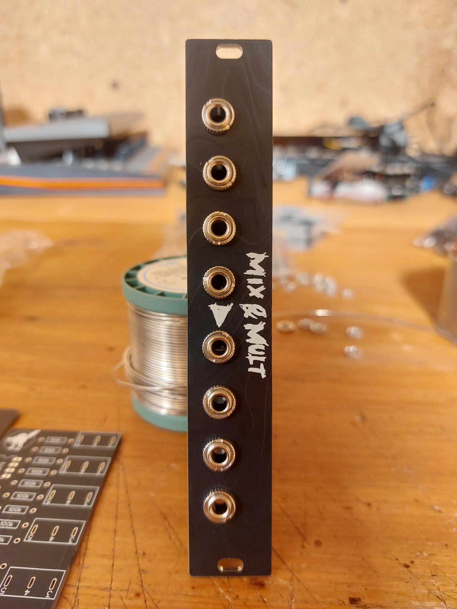
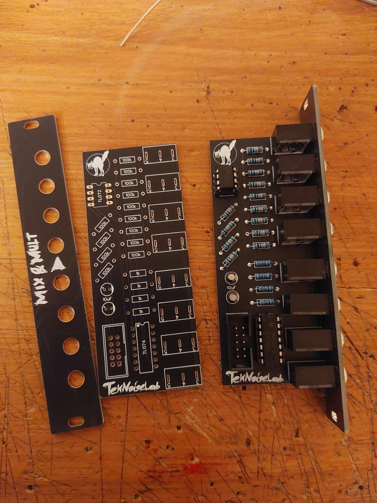

# mix&mult
A simple 4 channel mixer and 4 channel multiplier in 4HP in one module.
Useable for audio and CV signals.

## Build
- Order the PCBs from the PCB manufacturer of your choice.
- Order the components from your favorite electronics supplier.
- Solder the components to the PCB and mount the panel.

